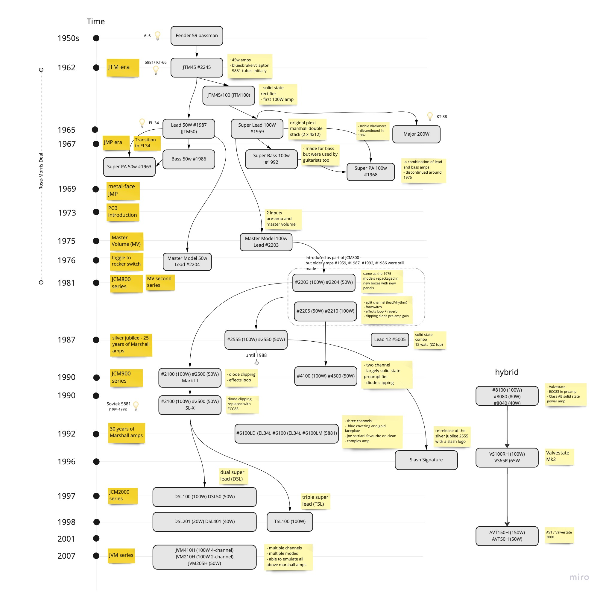

Title: Marshall Amps Genealogy Tree (From JTM45 to JVM series)
Date: 2022-05-23 00:58
Category: Music
Tags: guitar amp, marshall, genealogy tree, family tree, marshall history

This is an attempt to capture the evolution and history of Marshall amps,
covering the period from the release of the JTM45 in 1962, up to the release 
of the JVM series in the late 2000s. This is work-in-progress, feel free to suggest 
corrections and ways to extend the diagram in the comments. What I'm planning to add next is the
re-visited DSL series (after 2012) and the Origin series.

* Update #1: diagram updated to have a more complete view of the 60s amp models

<h3>Marshall Amps Genealogy Tree</h3>
 

