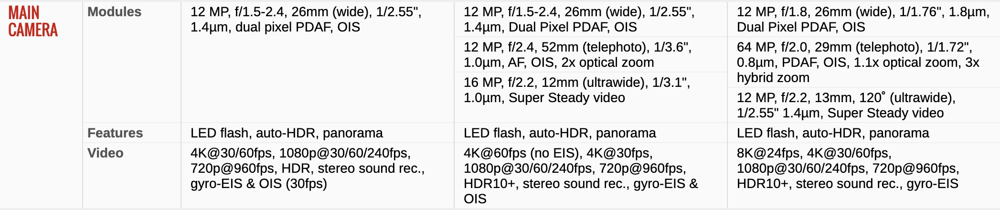
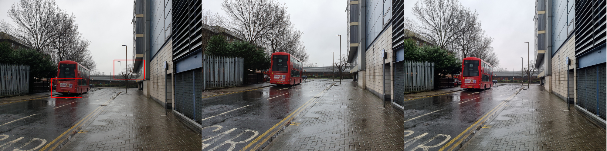
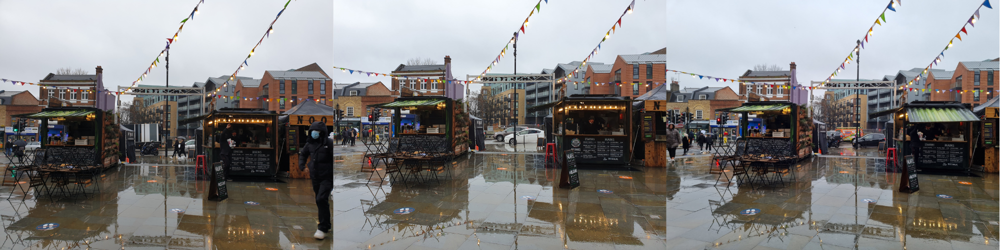
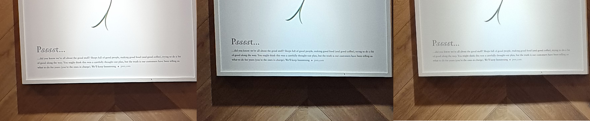
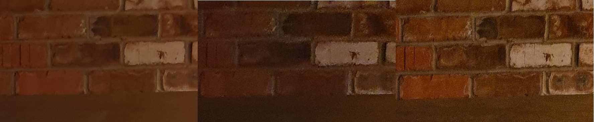
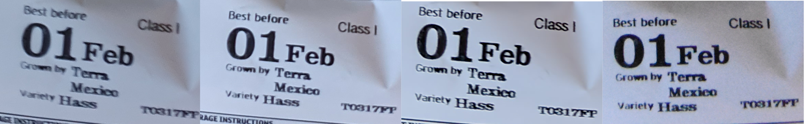

Title: Samsung Galaxy camera comparison S9 vs S10+ vs S21
Date: 2020-01-30 15:00
Category: Photography
Status: published
Tags: photography

With the release of Samsung Galaxy S21 we ended up with 3 generations of Galaxy phones at home, the S9, the S10+ and 
the more recent S21. I thought it would be a good idea to run a quick comparison regarding the camera performance of these
three devices. Note that the S9 was release in March 2018, S10+ in March 2019 and S21 in Jan 2021. To have an idea about
the official camera specs I've attached a comparison from gsmarena bellow.

The comparison is based on a series of very basic day-to-day shots (in "auto" mode) we all take with our phones and the 
images are available at their full resolution if you click on them. They appear from left to right in order 
of device release date, from earliest to latest (i.e. S9, S10+, S21). Let's start. 

<h3>Example 1 (outdoors) </h3>

All three look about the same, with some differences in exposure.

Having a closer look, I think that in S21 (and probably s20) they decided to move away from the over-sharpening
approach followed in S10+ which produced weird artifacts like the way number "4" is captured, 
and the text in "want to drive this bus?". The photo from S21 seems to have more noise in some areas e.g. the red colour on the 
bus is a bit grainy.  

Again, less sharpening, less contrast and more detail in S21, in general I'm not a fan of the 
post-processing applied here, it looks less like a photo and more like a drawing. 

<h3>Example 2 (outdoors) </h3>

Similar setup as in the previous example, negligible differences between the three cameras. The same comments as 
before apply for the sharpening. 

<h3>Example 3 (indoors) </h3>

The photo from S21 seems to have a wider dynamic range and better exposure. 

In the following cropped section the result from S21 is significantly better 
compared to S9 and S10+, mainly in terms of noise level and detail.

<h3>Example 4 (zoom 2x) </h3>

Decided to compare them at 2x zoom as S10+ has 2x optical zoom and S21 has a hybrid 3x zoom (using 1.1x optical zoom).

The lack of optical zoom in S9 is obvious in this comparison. The hybrid zoom in S21 seems to produce a more 
detailed photo with lower levels of noise. 

<h3>Example 5 (Low light indoors) </h3>

The "night mode" was enabled in all three devices for this photo and there's also a fourth image coming from a Nikon 
D3400 DSLR to make the comparison a bit more interesting. 

The S21 does a good job in this scenario as well, with good detail and very low noise (probably applying more extreme 
noise reduction during post-processing, however without affecting the image detail). 

To be able to take a photo without flash with the D3400 I had to use a pretty high ISO (128000) which caused a lot of
noise in the photo. With some post-processing it could look better but it's still not a great image. It's impressive
that modern smartphones can perform better than DSRLs in scenarios like this (at least "handheld" :D).

<h3>Verdict</h3>

The more recent S21 seems to be the best performer in this test. However, the differences between the S10+ and S21 are minimal 
and even comparing with the 3-year older S9, the differences are not massive. Going from S9 or S10 to S21 just for the minor
camera improvements wouldn't make a lot of sense. Nevertheless, I really enjoy other features of S21 so far, like the 120hz 
refresh rate of the screen which really makes a difference in comparison to S9/S10 (note though that it was also available 
in s20 so not an exclusive new feature of S21) and the faster cpu.
