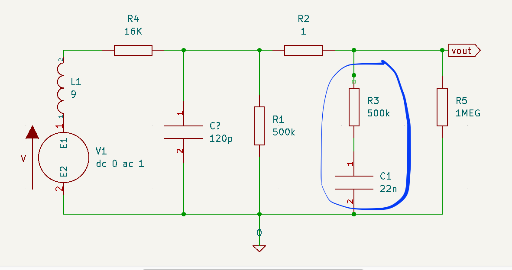
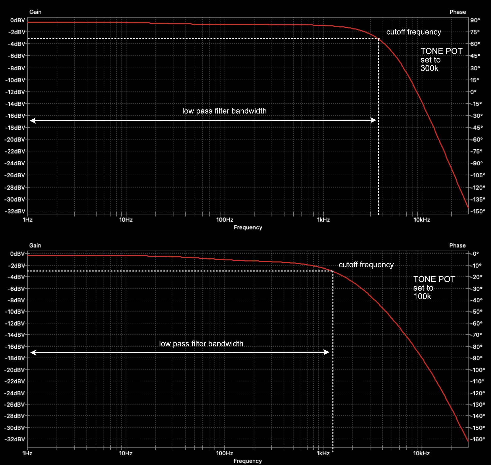
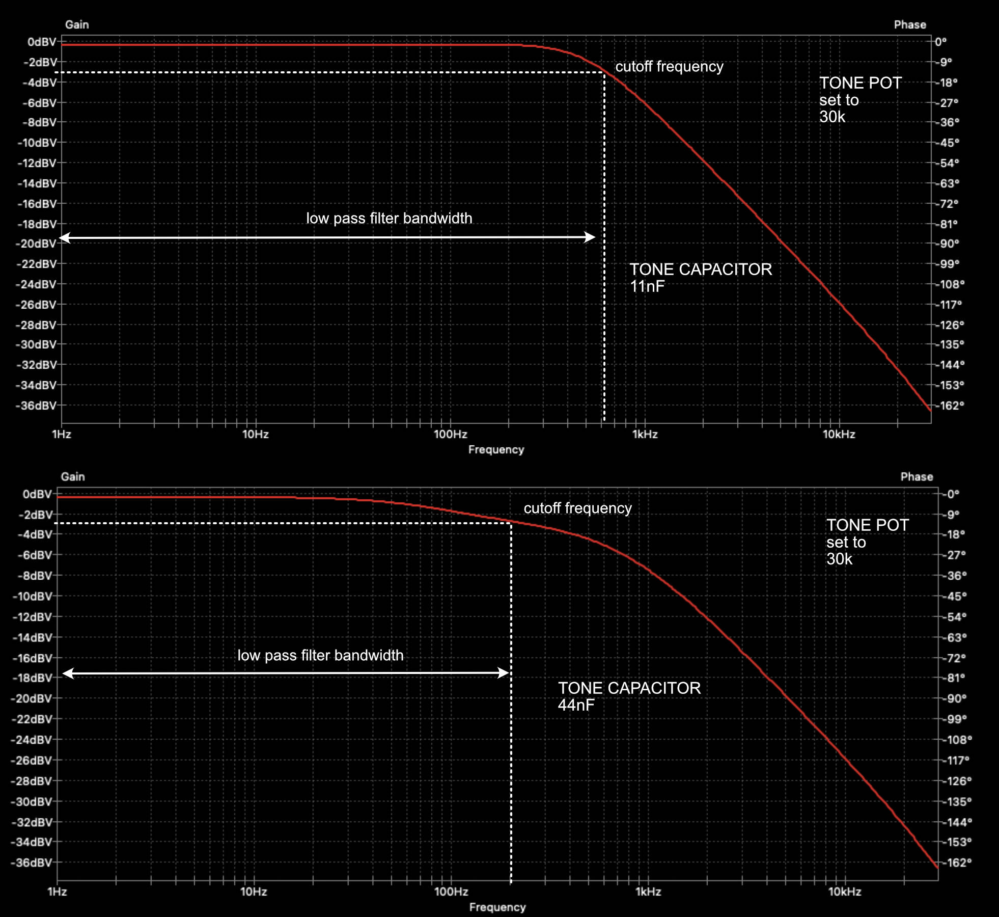

Title: Testing different types of guitar tone capacitors
Date: 2021-02-06 15:00
Category: Music
Tags: orange drop, paper in oil, polystyrene, polyester, ceramic, capacitors, RC filter, low-pass, guitar tone

A very common debate topic between guitar enthusiasts is the impact of capacitor types on the perceived tone.
There's at least two cohorts of guitar enthusiasts. In the first one, they believe that only
the capacitance (its size, in Farads) of the capacitor has impact on the frequency response and the type of the capacitor
doesn't matter. In the second, they believe that both, the size and type matter. There's a number of in-depth articles 
([example](http://web.archive.org/web/20030807122631/http://capacitors.com/picking_capacitors/pickcap.htm#intro))
where the impact of the type of capacitor on tone is discussed but I'll keep it at a high level here. The main point
is that the construction and materials of the capacitor lead to non-ideal behaviour e.g. 
the capacitance can be frequency dependant, the capacitance can be temperature dependant, etc. 

This article has two main sections, the first one has a bit of theory to better understand how the actual R and C
values of the low-pass filter affect the frequency response of the guitar. The second section describes the setup of
an experiment where different types of capacitors (of the same capacitance) were used to assess their impact on tone
by playing a number of samples on a guitar. The test specifically focuses on the capacitor used the in passive 
low-pass RC filter employed in the tone control section of your guitar.

<h3>A bit of theory</h3>

Below I've tried to model the circuit of a guitar with a single pickup (used the specs of a Seymour Duncan JB), 
a volume pot and a tone pot. In the blue circle I've highlighted the components used in the tone filter. 

 
Approaching it as an RC filter (although it's not exactly an RC filter), there is a cutoff frequency
where the gain of the of the circuit is -3dB. The cutoff frequency for an RC filter is given by the following
formula.

$$f_{cutoff} = \frac{1}{2\pi RC}$$

The area between 0 Hz and $f_{cutoff}$ defines the bandwidth of the filter. The circuit in our guitars is a bit more 
complicated than a simple RC filter but it's safe to assume that the bandwidth of the filter is inversely proportional
to the resistance of the tone pot and the capacitance of the tone capacitor.

A filter with a wider bandwidth will have more treble whereas a filter with a narrower bandwidth will have less treble.
The bandwidth on the guitar is controlled using the tone pot variable resistor and bellow I have two examples of the
frequency response retrieved by running a circuit simulator. One with
the pot set to $300k\Omega$ (which is equivalent to having the tone at around 7-8 - for $500k\Omega$, logarithmic pots), 
in the second example the tone pot is set to $100k\Omega$ (tone at around 4-5). As we can see the filter bandwidth
gets narrower, the smaller the value of the tone pot becomes.

Similarly, (and as expected from the RC filter formula) changing the value of the capacitor will also have an impact on
the bandwidth. Bellow I've set the tone pot to $30k\Omega$ and then I did run the simulation with an $11nF$ capacitor 
and then with a  $44nF$ capacitor. In the latter, the filter bandwidth gets narrower.

Now the question is, what happens when we keep the value of the capacitor as is but we change the type of the capacitor.
I didn't run a simulation for that, although it might be possible if we use a more realistic model of a non-ideal
capacitor. Instead, I run a test, which I'll describe below.

<h3>Test Setup</h3>
In order to be able to do quick A/B comparisons between capacitors without having to use a soldering iron I built a simple
circuit that allows to connect up to 5 different capacitors and enable one (or more - as I'm using latching switches) at a time.
As already mentioned a $500k\Omega$ tone pot is used along with the following capacitors (capacitance, as measured
with a multimeter, indicated in brackets):

 * Orange Drop  ($21.52 nF$)
 * Paper-in-Oil  ($26.47 nF$)
 * Polystyrene  ($22.35 nF$)
 * Polyester Film  ($22.35 nF$)
 * Ceramic  ($22.94 nF$)
 
The Parer-in-Oil capacitor is slightly larger than the nominal value, but it's not a huge difference and 
shouldn't have significant impact on the filter shape. The small circuit board was wired directly between the tone pot
and the ground on a Yamaha AES 620 guitar with 2 volume pots, a single tone pot and a toggle switch.

Four different samples were performed, every sample was played five times, once per capacitor type. 
The guitar pickup and the tone pot value was as follows for the four samples:

 * Sample 1: Bridge pickup (Seymour Duncan JB)  / Tone pot at 70%
 * Sample 2: Bridge pickup (Seymour Duncan JB) / Tone pot at 70%
 * Sample 3: Neck pickup (Seymour Duncan Jazz)  / Tone pot at 30% 
 * Sample 4: Bridge pickup (Seymour Duncan JB) / Tone pot at 70%

I won't share my thoughts around the results yet as I don't want to influence your assessment. 
You can find the full comparison in the link below. Feel free to share your thoughts and feedback in the comments.

<iframe width="560" height="315" src="https://www.youtube.com/embed/uBiWXnLaoWI" frameborder="0" allow="accelerometer; autoplay; clipboard-write; encrypted-media; gyroscope; picture-in-picture" allowfullscreen></iframe>

