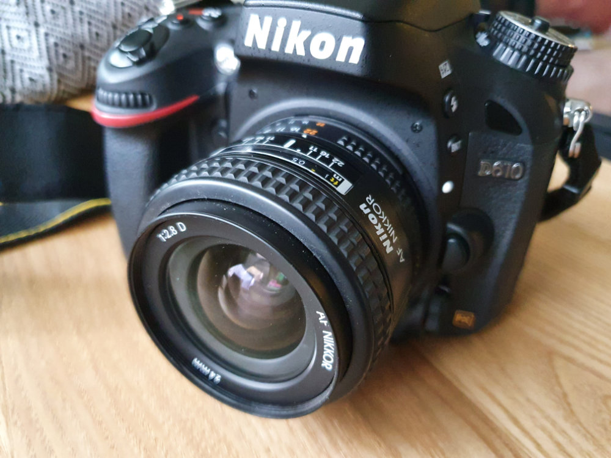
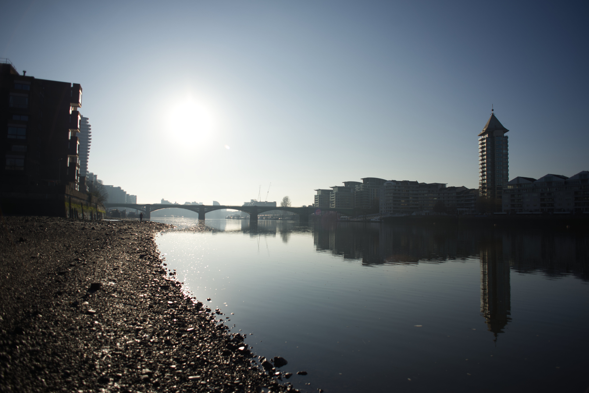
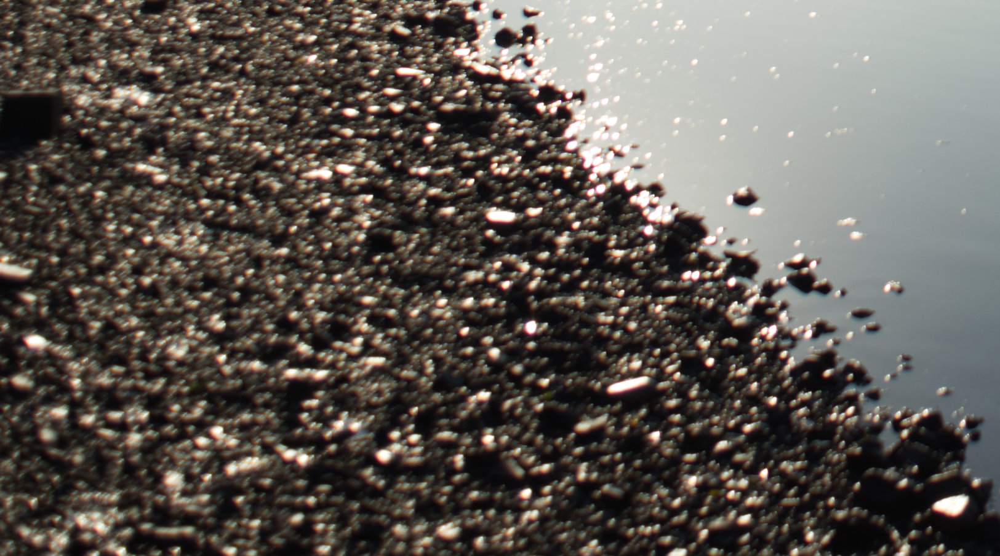
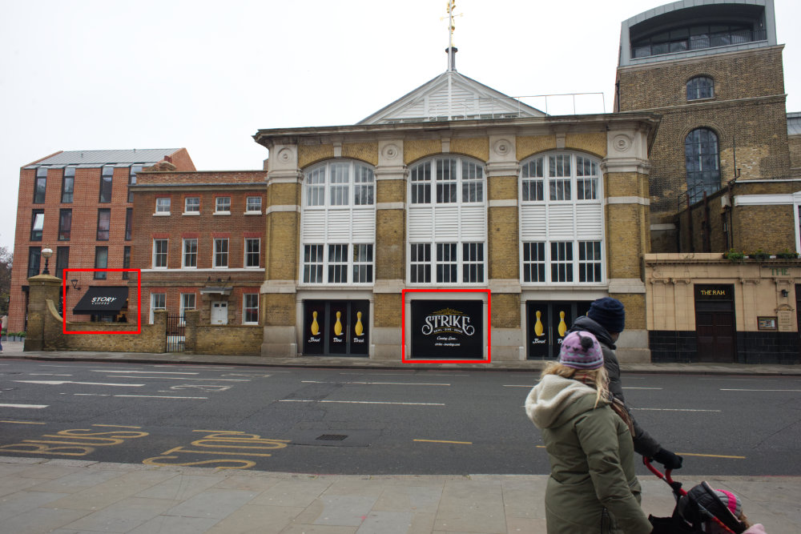
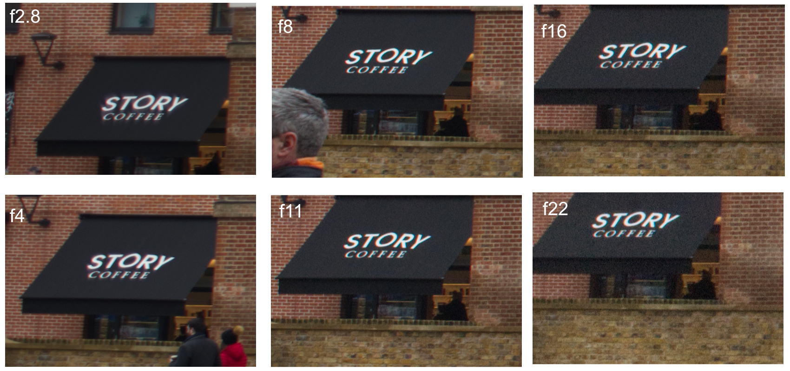
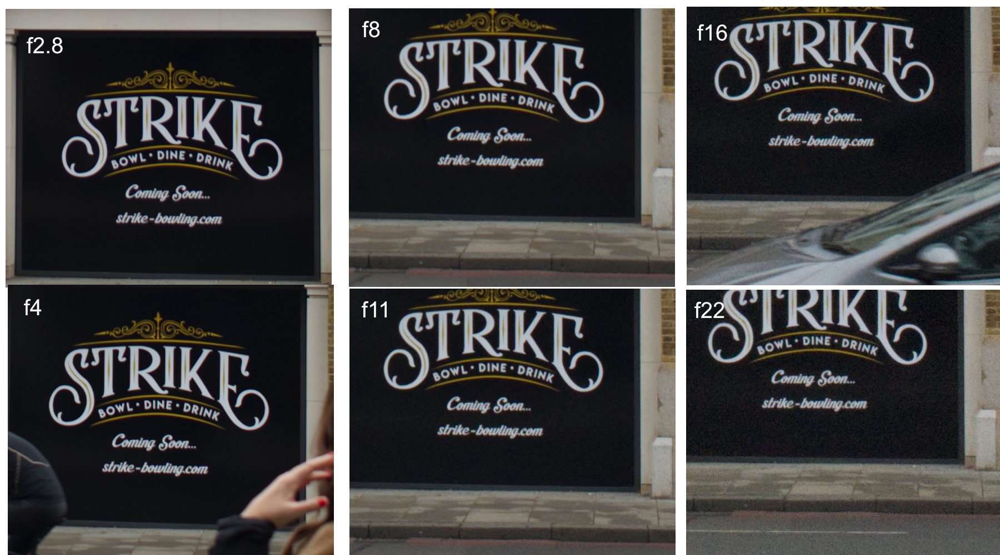

Title: Testing how sharp Nikkor 24mm f/2.8 AF-D is on Nikon FX
Date: 2021-01-10 14:00
Category: Photography
Status: published
Tags: photography, lens-test

During the covid-Christmas period I got a Nikkor 24mm f/2.8 AF-D ultra-wide lens for my Nikon D610 Fx series full-frame 
camera.  I got the lens from ebay for 138 GBP including postage which was a great price. For your information, this particular
model of the lens was released in 1994, some time before Nikon DSLRs were a thing.  

Recently I took some photos with the above gear combination and wasn't happy with the image quality, an example photo can be seen below.

If you check the bottom left corner of the image you'll notice it's quite blurry. The photo was taken with the 
following settings f/4, iso 100, 1/4000s. I was focusing to infinity, so that's part of the problem as with f/4 subjects
closer to the camera will be out of focus but in any case the effect wasn't pleasing to the eye. 

Based on the above I decided to take a shot using the full range of available apertures and see what works for me 
going forward. If anything worked for me in the end, as there was always a chance this lens wasn't good enough for my 
use case (which is still TBD, but I love sharp photos :-D). I knew before getting the lens that sharpness in the corners was 
not great with smaller f numbers, but wasn't expecting it to be that bad.

My test was very naive, and I was optimising for minimal effort on a Sunday morning. I took 6 photos 
(f2.8, f4, f8, f11, f16, f22) handheld, with a horrible sky that is impossible to not overexpose in Wandsworth Town, London. 

The test photos were like the following. This particular one was taken with f/11, iso 2200, 1/320s.

Bellow you can see 100% crops for the highlighted red boxes with all 6 apertures. The left box was chosen because
it's closer to the  edge of the image whereas the one in the middle is closer to the center. I chose these two 
because they contain text which makes it a bit easier to assess sharpness (without special tooling).

Corner sharpness:

Center sharpness:

I have not included the iso and exposure values used but I was shooting in aperture priority mode so you can make 
your guesses. Obviously under the particular weather/light conditions noise was becoming an issue for smaller apertures
but I don't think it affects the results of the tests.

My conclusion for now is that something between f/8 and f/11 is going to work for me. For landscapes with good light 
or using a tripod I think I could live with the Nikkor f/2.8 AF-D 24mm. Will avoid anything bellow f5.6 
most of the time. 

For my latest photos check <a href="https://500px.com/p/vismajeure">https://500px.com/p/vismajeure</a>. 
