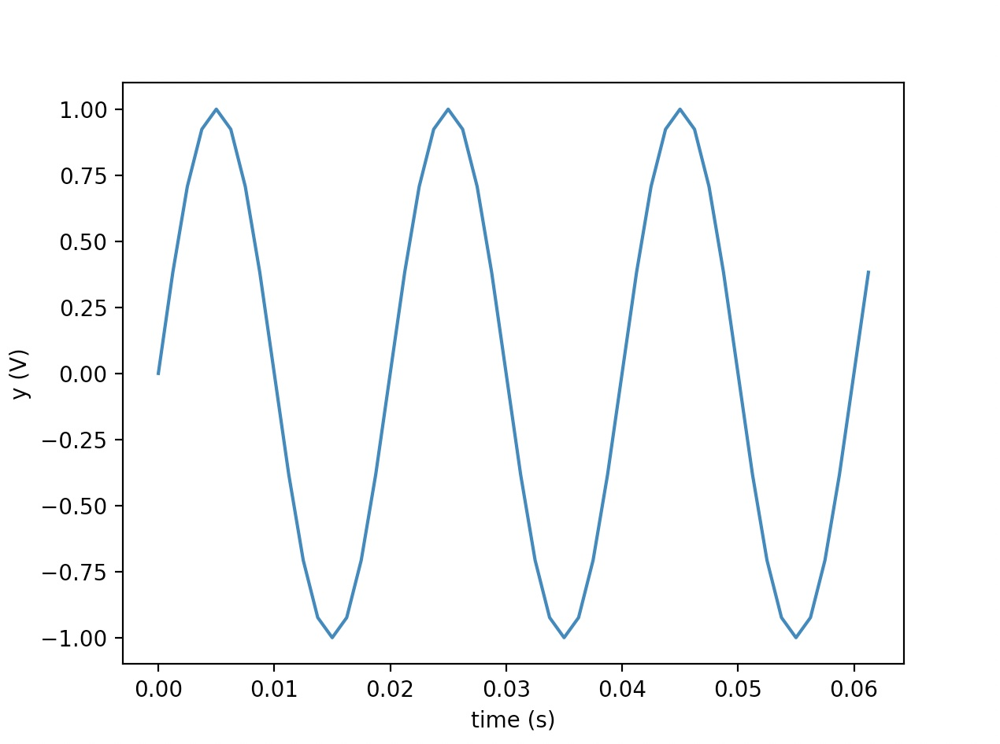
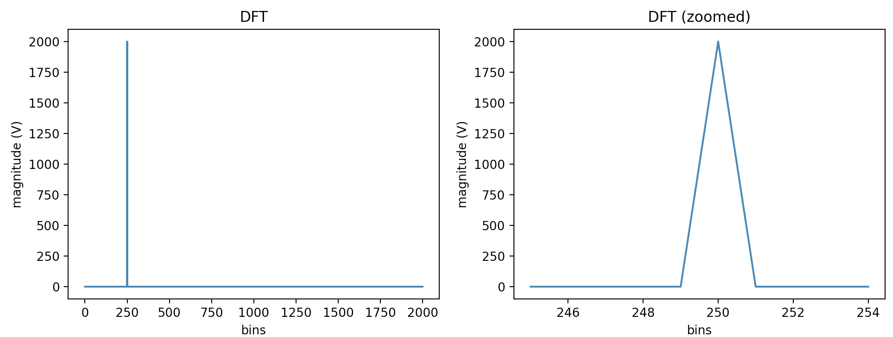
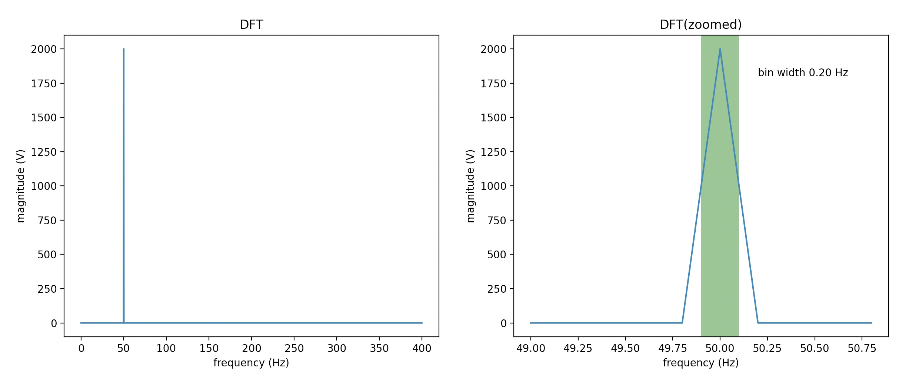
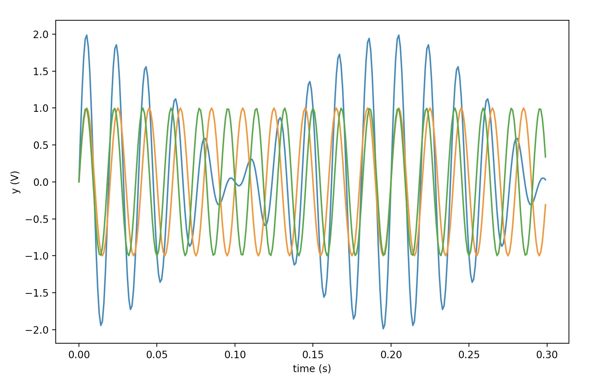
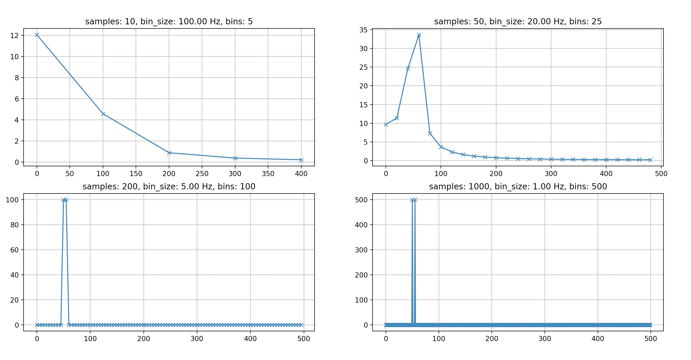

Title: Understanding DFT's Temporal and Frequency resolution
Date: 2014-07-04 15:00
Category: Machine Learning
Tags: fourier transform, fft, dft


This post is an attempt to provide an intuitive approach in understanding DFT's temporal and frequency resolution 
characteristics. We will implement everything from scratch using python in order to conduct an as straightforward as possible analysis with minimal dependencies.


<h3>Discrete Fourier Transform (DFT)</h3>

The forward discrete fourier transform (DFT):

$$X_k = \sum_{n=0}^{N-1} x_n \cdot e^{-i~2\pi~k~n~/~N}$$

For the DFT calculation I will borrow the not optimized implementation from [an other](http://jakevdp.github.io/blog/2013/08/28/understanding-the-fft/) blog post.

```
#!python
import numpy as np
def DFT(x):
    """Compute the discrete Fourier Transform of the 1D array x"""
    x = np.asarray(x, dtype=float)
    N = x.shape[0]
    n = np.arange(N)
    k = n.reshape((N, 1))
    M = np.exp(-2j * np.pi * k * n / N)
    return np.dot(M, x)
```

<h3>Signal Generation / Sampling</h3>

We need to define an example signal that will be used for the analysis. A sine voltage signal would be appropriate in our case.

$$y = Asin(\omega t+\phi)$$

Let's create and sample our sine wave. ($A=1$, $\phi=0$)

```
#!python
import matplotlib.pyplot as plt

f = 50.0 
T = 1/f * 1000 
omega = 2 * np.pi * f

print(f'Signal Frequency: {f} Hz (Period: {T} ms)')

fs = 800.0 
t = np.arange(0, 5, 1/fs)
y = np.sin(omega * t)

print(f'Sampling Rate: {f} Hz, Duration: 5.0 s')
print(f'Number of samples: {len(t)}')

plt.figure()
plt.plot(t[0:50],y[0:50])
plt.ylabel('y (V)')
plt.xlabel('time (s)')
plt.show()
```

The output of the above is 

```
Signal Frequency: 50.0 Hz (Period: 20.0 ms)
Sampling Rate: 50.0 Hz, Duration: 5.0 s
Number of samples: 4000
```



<h3>DFT calculation</h3>

Let's calculate the DFT using the above signal as input.

```
#!python
dft = DFT(y)

dft_magnitude = abs(dft)[0:int(len(dft)/2)]
print(f"DFT bins: {len(dft_magnitude)}")

f_nyquist = fs / 2
print(f"Nyquist frequency: {f_nyquist} Hz")

plt.figure(figsize=(12,4))
plt.subplot(121)
plt.title('DFT')
plt.xlabel('bins')
plt.ylabel('magnitude (V)')
plt.plot(dft_magnitude)
plt.subplot(122)
plt.xlabel('bins')
plt.ylabel('magnitude (V)')
plt.title('DFT (zoomed)')
plt.plot(np.arange(245,255), dft_magnitude[245:255])
plt.show()
```

The output of the above is 
```
DFT bins: 2000
Nyquist frequency: 400.0 Hz
```


The Nyquist frequency is equal to $\frac{1}{2}$ of the sampling rate of a discrete signal processing system. Based on the fact that the Nyquist frequency is the maximum frequency we can have in our DFT spectrum we can calculate the DFT bin size as follows:

```
#!python
dft_bin_width = f_nyquist / len(dft_magnitude)
print(f"DFT bin width: {dft_bin_width} Hz") 
```

```
DFT bin width: 0.2 Hz
```

We can now redraw the DFT spectrum using Hz as the x-axis unit this time.

```
#!python
plt.figure(figsize=(12,4))
plt.subplot(121)
plt.title('DFT')
plt.ylabel('magnitude (V)')
plt.xlabel('frequency (Hz)')
plt.plot(np.arange(0,len(dft_magnitude)) * dft_bin_width, dft_magnitude)
plt.subplot(122)
plt.title('DFT(zoomed)')
plt.ylabel('magnitude (V)')
plt.xlabel('frequency (Hz)')
plt.plot(np.arange(245,255)* dft_bin_width, dft_magnitude[245:255])
plt.axvspan(249.5*dft_bin_width,250.5*dft_bin_width, facecolor='g', alpha=0.5)
plt.annotate('bin width %2.2f Hz' % dft_bin_width, xy=(50.2,1800))
plt.show()
```



The peak in the DFT spectrum is, as expected, at:

```
#!python
print(f"{(dft_magnitude.argmax() * dft_bin_width)} Hz")
```
```
50.00 Hz
```

Based on the above:

$$DFT~bin~width = \frac{f_{nyquist}}{n_{samples}} = \frac{f_s / 2}{n_{samples}} $$

where, if we consider $f_s$ constant, we conclude that DFT bin width is inversely proportional to the number of samples we use to calculate the DFT.

Rephrasing, DFT **frequency resolution is inversely proportional to the temporal resolution**.

Of course, we should always not forget that by increasing the sampling rate we can get more samples in less time and consequently improve both our temporal and frequency resolution.

<h3>Example</h3>

To better understand our conclusion we will explore how temporal and frequency resolution relate to each other with an example. Let's define a signal similar to the one we initially defined but this time containing 2 sine waves with frequencies equal to 50 and 60 Hz.

```
#!python
f1 = 50.0  
f2 = 55.0

fs = 1000.0
t = np.arange(0, 5, 1/fs)
y1 = np.sin(2 * np.pi * f1 * t)
y2 = np.sin(2 * np.pi * f2 * t)
y = y1 + y2

print(f'Sampling Rate: {fs} Hz, Duration: 5.0 s')
print(f'Number of samples: {len(t)}')

plt.figure()
plt.plot(t[0:300],y[0:300]) # printing the first 300 values
plt.plot(t[0:300],y1[0:300])
plt.plot(t[0:300],y2[0:300])

plt.ylabel('y (V)')
plt.xlabel('time (s)')
plt.show()

f_nyquist = fs / 2
print(f'Nyquist frequency: {f_nyquist} Hz')
```
```
Sampling Rate: 1000.0 Hz, Duration: 5.0 s
Number of samples: 5000
Nyquist frequency: 500.0 Hz
```


Let's see how the number of samples (i.e. temporal resolution) affects the DFT bin size (i.e. frequency resolution) 
and when we have problems.

```
#!python
samples = np.array([10,50,200, 1000])

plt.figure(figsize=(18,8))
for k,s in enumerate(samples):
    dft = DFT(y[0:s])
    dft_magnitude = abs(dft)[0:int(len(dft)/2)]
    dft_bin_width = f_nyquist / len(dft_magnitude)

    plt.subplot(2,2,k+1)
    plt.grid()
    plt.title("samples: %i, bin_size: %2.2f Hz, bins: %i" % (s, dft_bin_width, len(dft_magnitude)))
    plt.plot(np.arange(0,len(dft_magnitude)) * dft_bin_width, dft_magnitude, '-x')
plt.show()
```



We see that when the number of samples used to calculate the DFT (which is effectively the length of the 
analysis window) drops bellow 1000 we are unable to identify the two superimposed sine signals. Similarly, 
if we had a signal that changed rapidly over short periods of time, and we wanted to be able to track those changes 
in the time domain, then we would have to make sacrifices in our frequency domain resolution.

<h3>Conclusion</h3>
I hope the above analysis has helped you become a bit more familiar with the challenges we face 
when using this wonderful tool (i.e. the DFT). 
Hopefully, next time you'll have to decide about the size of your analysis window or the required sampling rate 
you will have the right arguments to support your decisions.
