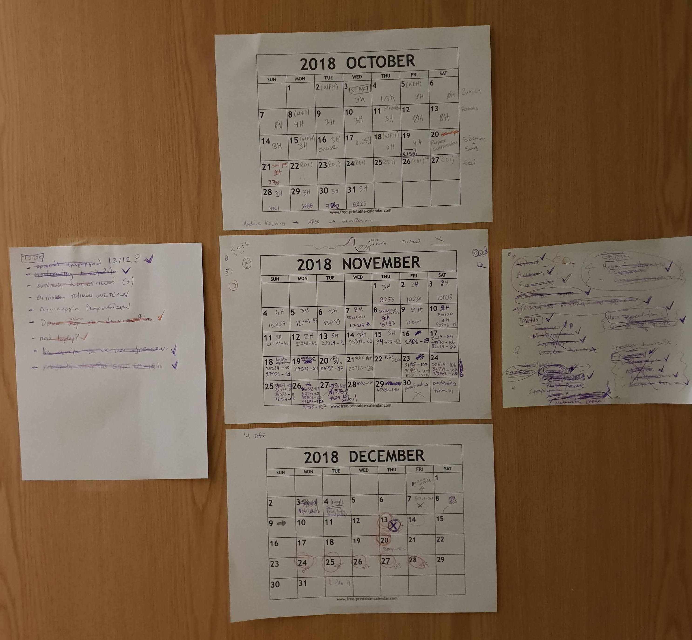
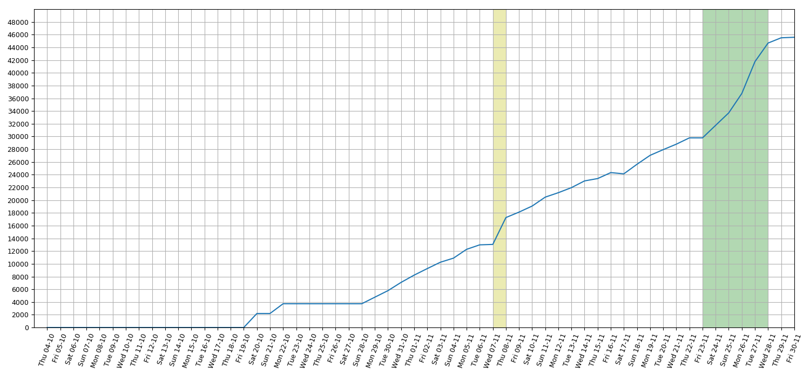
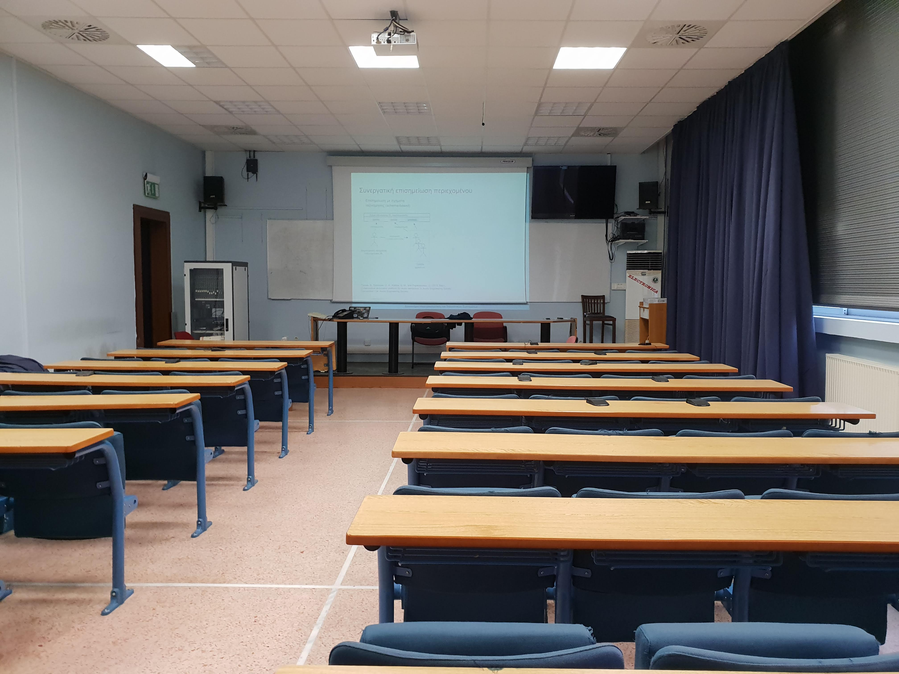

Title: A small story about writing my PhD Thesis
Date: 2019-02-27 18:00
Category: Other
Status: published
Tags: phd, thesis, viva, latex, git 

In September 2018 I met my supervisor in Greece to decide the plan of action for the next phase. 
Since, at that point I was satisfying all the criteria of my university (most importantly the number of publications) 
we agreed that I should start writing my dissertation and have my Viva before Christmas. 
At that point I only had the latex template of my Thesis and a first version of the table of contents and abstract. 
In parallel, I was trying to finish and submit my latest paper, which although was not a prerequisite to 
present my Thesis, was a brilliant way to summarize all the great work done in the deep learning space during the 
last 18 months. The experiments were finalised but I did spend another month refining the paper and reviewing it 
with my supervisor. 

#### The writing

In October I had a clear plan in my head regarding what should be included in my Thesis. The majority of the 
chapters would be based on my publications and that was the "easy" part. The "more challenging" part would 
be the introductory chapters and the conclusions. In the former, the problem and the research questions would have to 
be defined in a clear way along with the theoretical framework that would allow readers to follow the subsequent chapters. 
The latter, would include my contributions to the field and as such it should be clear and precise. The writing 
"officially" started on the 3rd of October, however until 20 Oct I was still working in parallel on the paper
and then I was off for a week travelling for work. I was back on 27 Oct and I started from the "easy" part and 
whenever I was writing I was keeping track of time  and number of words produced. 
I already had examples of dissertations from previous PhD students in my 
lab which I used to  get an estimate of the number of words of a completed Thesis. It was a quite wide range, 
from 40k words to 90k words 
and although it did not mean too  much as an absolute value, it was super useful to be able to keep track of my 
progress using a quite accurate unit of measurement ..the word. I set a goal of 45k words, and since I had some 
estimates of my words/min rate from the first few days of writing, I could predict when I would be able to deliver 
the whole Thesis. Of course the rate  depends on many factors and one of the most important ones is whether you're 
writing the "easy" or the "more challenging" parts of the Thesis.

<blockquote class="blockquote">
..focus on the "more challenging" parts where there was a significant higher number of unknowns
</blockquote>

Although it felt really hard at that point, I was confident that I should force myself to stop writing the "easy" parts 
and instead focus on the "more challenging" parts where there was a significant higher number of unknowns.
And that's exactly what I did. I had a printed calendar taped on one of the doors in my flat, and on it I was keeping track 
of my progress along with deadlines and important milestones. Remember that I still didn't have the exact date of my 
Viva but I had a specific week in my mind that could work. I was writing for 4-6 hours on weekdays after work and for 10-15 
hours on weekends with almost zero breaks. Although I didn't have a real deadline, I mean I could always ask my 
supervisor to move my Viva into the new year (Plan B), I really wanted to finish with my Viva as soon as possible so 
I was a 100% focused on Plan A, almost ignoring Plan B as an option. I kept my supervisor up to date 
based on my estimates and on the 4th of December we agreed that I'll have my Viva on the 13th of December. 

#### Some stats

I couldn't miss the chance to add some stats on this post, so here they are, the number of words written
per day. The yellow annotation indicates the point when I changed the way I was measuring the number of words. 
For the record, I ended up using `pdftotext main.pdf  - | wc -w`. The green annotation indicates the days I was 
on annual leave from work in order to increase my throughput and meet the deadline.  

#### Creating a presentation

The presentation is the mechanism that will allow you to communicate your ideas in a clear way in a short amount of time
during the Viva, it's a tool. Most of the content comes from the Thesis but in many cases I had to either structure it 
differently or present it using some kind of diagram. The usual guidelines applying to any other kind of presentation apply 
to this one too i.e. avoid big blocks of text, visualise information when it makes sense, etc. The biggest part of my 
presentation was technical and focused on my contributions, however I needed to get the balance right for an audience that
would have different levels of knowledge in this field. Of course I had a sense of what's too complex to go into the
presentation but the safest way to decide that was by practicing. Practicing helped to identify
slides that were too complex to explain in less than a minute and also helped to get an estimate of the duration 
of the presentation. I was capturing videos of myself while practicing, I never watched most of them but were useful 
to measure time and check how I looked while presenting. My biggest concern was the words per minute rate as I tend
to speak fast, so the goal was to gradually make the sessions slightly longer by reducing my speech rate. I practiced 
the presentation somewhere between 10 and 20 times during a week. I reached a point where I knew exactly what I was going
to say for every slide and that was making me more confident. 

<blockquote class="blockquote">
The Thesis writing feels like the last few meters in a long run, don't expect it to be easy, treat it with respect,
 be cautious and smart.
</blockquote>

#### The Viva

The night before my Viva, there was a Christmas party in my university and most of the PhD students from my lab were 
there as well as my supervisor. Since I was feeling ready for the Viva I went for a drink, was good to see all of them
and relieved some of the stress I was feeling. I went home early, around midnight, and tried to sleep. Of course, in
terms of sleep it was one of the worst nights ever, woke up several times, was anxious, however I was feeling ok and 
ready in the morning. I went to my uni early, got the keys of the classroom where the Viva would take place and got there
to get familiar with the place, test the projector and my laptop, etc. You need to do that, especially if you haven't been
to that area for some time, as in your mind (or at least in my mind) everything is much more serious, 
much more strict and formal. The reality made me feel much better. Of course I realised that the colours on my slides, 
that looked perfectly fine on my laptop, looked quite fainted on the projector with the classroom lights on, but you can't
have everything, can you?

 
The presentation went according to plan, the flow was close to perfect and I was quite relaxed. I even
noticed some tiny typos, that no-one else did, while I was presenting. There were no interruptions during the presentation.
After the end of it there were questions from the 7 professors of the Viva committee. They seemed to be happy with 
the presentation and my answers to their questions.Most questions were about them wanting to know more about a specific 
aspect of the presented work and it never felt like
an exam or something like that. After the end of the questions session we all went out of the room to allow 
the committee to decide if my Viva was successful or not. After
4-5 minutes they announced their decision to me and the audience, I was successful!  When the committee announced 
their decision to me I thanked them and told them that I was very very happy. 
What a relief, after 6 years. It felt like I should celebrate for the next 6 months!

#### A few things that I learned on the way and might help you too

- The Thesis writing feels like the last few meters in a long run, don't expect it to be easy, treat it with respect,
 be cautious and smart. 

- Set a goal while writing. For me counting words worked very well, for you something else might work better, but it's
definitely beneficial to keep track of progress and be able to see the end of the tunnel.

- Be consistent and focused, sacrifice a bit more of your personal/socialising/weekend/evening time to get this out of the way. 

- The Thesis is yours, reviewing a long document is a bit different compared to the reviews of 10 page papers during 
your PhD. Not many people will have the chance or the time to read your work in its full extent. Accept it and 
take ownership.

- Find someone who went through the whole process recently and learn as much as possible. 

- It's interesting that although I was doing a part time PhD, which is a lot of work, I was able to remain very 
productive at work. I would even say that I felt more productive when I was in that mindset with a higher daily workload.
However, that's probably unsustainable and it's good that I can now finally decide what to do with my free time.

#### What's next?

I felt a bit weird after finishing my PhD, it felt like I didn't have something to look forward to. 
On the other hand, the last few years I had so many ideas that I wanted to materialize but were never getting "prioritized".
Hopefully, as soon as these ideas start getting shape and I start working towards new goals, this feeling will go away!
For now, I'm still enjoying this small break, doing some travelling, spending time with friends and family and every now
and then thinking "what's next?". 